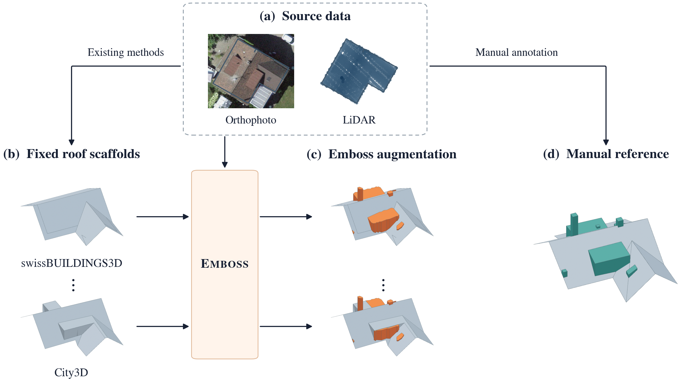

# Emboss

[Paper (TODO)](TODO_PAPER_URL) · [API reference](#api-reference) · [Citation](#citation)

## Overview

Emboss reconstructs roof details from aerial imagery and LiDAR using swissBUILDINGS3D scaffolds. Select a house or an area in Switzerland and generate detailed 3D building models.

Attached buildings, flat roofs, and nonresidential buildings are included; there is no detached-house filter. Each selection needs roof geometry in the source dataset.

[Shading-aware PV](https://github.com/tobiasvonarx/shading-aware-pv) builds on Emboss for solar modeling and panel placement.



## Installation

Install [uv](https://docs.astral.sh/uv/), GDAL **3.13.0** with development headers (`gdal-config` on `PATH`), and a C/C++ compiler. A CUDA GPU is optional and speeds up reconstruction.

```bash
git clone https://github.com/tobiasvonarx/emboss.git
cd emboss
uv sync --locked
cp .env.example .env
```

uv installs the project's Python version and locked dependencies in a separate environment. If GDAL is outside the standard library path, set `NATIVE_PREFIX` in `.env` to its installation directory.

## Getting started

From the repository directory, run:

```bash
uv run --locked emboss
```

Open **http://127.0.0.1:5001**.

1. Search for an address, click a roof, or draw an area on the map. Keyboard users can pan the map with arrow keys and press Enter to select.
2. Prepare the selection, compare the orthophotos side by side, and click your preferred image. Choose **Confirm & model**. For an area, review individual buildings or keep the automatic choices.
3. Inspect the 3D roof, orthophoto, scaffold footprint, and segmentation overlay in **My buildings**.
4. Choose **Change orthophoto** to reopen the image gallery. Pick an image and choose **Use image & rerun** to update the segmentation and model.
5. Download meshes, roof-detail GeoJSON, and reconstruction data.

Use **Remove** beside a building to remove it and its saved model from My buildings. Choose **Undo**, or restore it later under **Removed buildings**. Shared downloads are kept.

Imagery, LiDAR, and the pinned [segmentation model](https://huggingface.co/tvonarx/emboss-segmentation) download automatically. The first Swiss acquisition needs about 13 GB for the building dataset, plus space for tiles and models.

Data and results are saved in `./data`. Edit [.env](.env.example) to change `PORT`, `DATA_DIR`, `WORKERS`, and `DEVICE`, then restart.

## API reference

### Python

Save this as `example.py` and run `uv run --locked python example.py`. GDAL must be available on Python's library path.

```python
from emboss.api import Client

client = Client("./data", workers=2, device="auto")
selection = client.store.acquire({
    "mode": "house",
    "longitude": 7.055825,
    "latitude": 46.779828,
})
house_id = selection["houses"][0]
result = client.reconstruct(house_id, progress=print)

print(result.mesh_path)
print(result.roof_details_path)
print(result.orthophoto_path)
```

For an area, use `{"mode": "area", "bbox": [west, south, east, north]}` in WGS84 longitude/latitude, then call `client.reconstruct_many(selection["houses"])`.

| Method | Purpose |
| --- | --- |
| `client.store.list_houses()` | List acquired buildings |
| `client.reconstruct(house_id)` | Build a model or reuse a matching cached result |
| `client.reconstruct(house_id, force=True)` | Recompute the model and corrected imagery |
| `client.reconstruct_many(house_ids)` | Reconstruct several houses, returning results in input order |
| `client.load_result(house_id)` | Load an existing result and verify its artifacts |

Reuse the client across houses. Input, model, or imagery changes invalidate cached reconstructions. For manual image selection, pass `strip_id_override="strip-id"`; use `reset_strip_override=True` to restore automatic selection. Python batch errors propagate; HTTP batches report failures per house.

### Roof geometry for downstream applications

`emboss.roof_surface.exposed_roof` returns the uppermost roof triangles and their source-face IDs. `emboss.surface_semantics.classify_faces` recovers scaffold/detail labels from the reconstruction’s `scaffold.geojson` and `roof_details.geojson`, independently of mesh connectivity. Keep the full mesh for shading; use exposed, semantically eligible surfaces for placement. `covered_footprint` computes height-aware obstructions for a particular supporting plane.

### Embed image selection

Downstream FastAPI apps can reuse the same orthophoto gallery and local imagery endpoints:

```python
from emboss.imagery_web import mount_imagery

mount_imagery(app, client)
```

Load `/emboss-imagery/style.css` and import `ImageGallery` from `/emboss-imagery/gallery.js`. The component shows corrected candidates with footprint overlays; the host confirms the choice and passes it to `Client.reconstruct`.

### HTTP

Start the app first. [Interactive API documentation](http://127.0.0.1:5001/docs) includes all request and response schemas.

Acquire a house:

```bash
curl -X POST http://127.0.0.1:5001/api/acquisition \
  -H 'Content-Type: application/json' \
  -d '{"mode":"house","longitude":7.055825,"latitude":46.779828}'
```

Poll `/api/acquisition/ACQUISITION_ID` using the returned job ID. When complete, use a house ID from its result to start reconstruction:

```bash
curl -X POST http://127.0.0.1:5001/api/reconstructions \
  -H 'Content-Type: application/json' \
  -d '{"houses":["HOUSE_ID"]}'
```

Replace `HOUSE_ID` with an acquired ID; add more IDs to process an area.

| Method | Endpoint | Purpose |
| --- | --- | --- |
| GET | `/api/houses` | List acquired buildings |
| DELETE | `/api/houses/HOUSE_ID` | Remove a building and its saved model; returns an undo token |
| GET | `/api/removed-buildings` | List removed buildings |
| POST | `/api/removed-buildings/TOKEN/restore` | Restore a removed building and model |
| POST | `/api/houses/HOUSE_ID/imagery` | Prepare image choices before reconstruction; returns a job |
| GET | `/api/imagery-jobs/JOB_ID` | Poll image preparation; completed result contains candidates and footprint |
| GET | `/api/houses/HOUSE_ID/imagery/preview?candidate_id=STRIP_ID` | Load a gallery image without changing the model |
| GET | `/api/reconstructions/JOB_ID` | Poll reconstruction progress and per-house failures |
| GET | `/api/results` | List completed models |
| GET | `/api/results/HOUSE_ID` | Read result metadata |
| GET | `/api/results/HOUSE_ID/mesh` | Read viewer geometry |
| GET | `/api/results/HOUSE_ID/imagery` | Read available correction candidates, current choice, and segmentation legend |
| GET | `/api/results/HOUSE_ID/orthophoto.png` | View the saved orthophoto |
| GET | `/api/results/HOUSE_ID/segmentation.png` | View the transparent segmentation overlay |
| GET | `/api/results/HOUSE_ID/imagery/preview?candidate_id=STRIP_ID` | Preview an alternative without changing the saved model |
| GET | `/api/results/HOUSE_ID/artifacts/ARTIFACT` | Fetch a named artifact |
| GET | `/api/results/HOUSE_ID/download` | Download the model bundle as ZIP |

For individual choices in a batch, pass `"image_choices": {"HOUSE_ID": "STRIP_ID"}` in the reconstruction request (use `null` for automatic selection). To apply one candidate to the request, include `"strip_id_override": "STRIP_ID"` in the reconstruction request. Use `"raw"` for the uncorrected image, or `"reset_strip_override": true` to restore automatic selection. The footprint outline comes from the saved scaffold (currently swissBUILDINGS3D) and appears on candidate previews too. The orthophoto and overlays retain the saved raster grid; preview colors do not change the scientific class map.

### Outputs

```text
data/results/<house-id>/
├── bundle.json          # Artifact paths, source provenance, and checksums
├── result.json          # Native reconstruction (emboss-result-v5)
├── prediction.json      # Compatible emboss-eval-prediction-v2 envelope
├── mesh.ply             # Reconstructed building
├── roof_details.geojson # Fitted roof details
├── inputs/              # Corrected imagery and scaffold mesh
├── rasters/             # Segmentation and reconstruction rasters
└── diagnostics/         # Fit diagnostics
```

Swiss outputs use EPSG:2056 horizontally, EPSG:5728 for elevations, and metres. Keep the full bundle when moving results. Preserve `DATA_DIR` to retain source tiles for reruns or downstream analysis; the ZIP contains reconstruction outputs, not the full source cache.

## Citation

TODO: add the paper citation and BibTeX entry.
